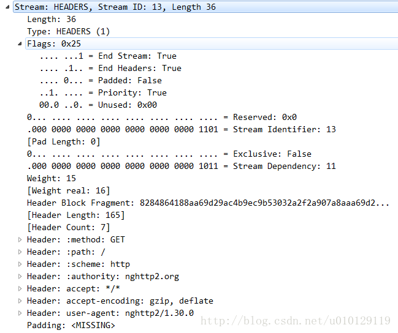

HEADERS帧(type=0x1)用于打开一个流，此外还携带一个header块片段。HEADERS帧可以在状态为”idle”，”reserved (local)”，”open”，或”half-closed (remote)”的流上发送。

## 帧格式

```
 +---------------+
 |Pad Length? (8)|
 +-+-------------+-----------------------------------------------+
 |E|                 Stream Dependency? (31)                     |
 +-+-------------+-----------------------------------------------+
 |  Weight? (8)  |
 +-+-------------+-----------------------------------------------+
 |                   Header Block Fragment (*)                 ...
 +---------------------------------------------------------------+
 |                           Padding (*)                       ...
 +---------------------------------------------------------------+
```

HEADERS帧具有如下的字段：

- Pad Length/填充长度

  8位的字段，包含以字节为单位的帧的填充长度。只有在PADDED标记设置时这个字段才出现。

- E

  单bit的标记，指示流依赖是独占的。这个字段只有在PRIORITY标记设置时才会出现。

- Stream Dependency/流依赖：31位的流标识符，标识这个流依赖的流。这个字段只有在PRIORITY标记设置时才会出现。

- Weight/权重

  无符号8位整型值，表示流的优先级权重。将值加1以获得介于1和256之间的权重。这个字段只有在PRIORITY标记设置时才会出现。

- header块片段/Header Block Fragment

  一个header块片段。

- 填充/Padding

  填充字节。 

## 标记

HEADERS帧定义了如下的标记：

- END_STREAM (0x1)

  当设置时，位0表示这个header块是终端将是被标识的流发送的最后一个块。

  HEADERS帧可以携带 END_STREAM 标记，标明流的结束。然而，在相同的流上，一个设置了 END_STREAM 标记的HEADERS帧后面可以跟着 CONTINUATION 帧。逻辑上来说，CONTINUATION 帧是 HEADERS 帧的一部分。

- END_HEADERS (0x4)

  若设置，位2 指示该帧包含整个头部块，并且没有任何CONTINUATION帧。没有END_HEADERS标记集的HEADERS帧必须跟随同一个流的CONTINUATION帧。接收方必须将接收到的任何其他类型的帧或不同流上的帧视为PROTOCOL_ERROR类型的连接错误。

- PADDED（0x8）：若设置，位3 指示Pad Length字段及其描述的填充符存在。
- PRIORITY（0x20）：若设置，位5 指示存在专用标志（E），流依赖性和权重字段。

PRIORITY帧在wireshark中所示：



## 载荷

HEADERS帧的载荷包含一个header块片段。不适合放在HEADERS帧中的header块在CONTINUATION帧中继续。

HEADERS帧必须与流关联。如果收到的流标识符字段为0x0的HEADERS帧，收件人必须响应`PROTOCOL_ERROR`类型的连接错误。

如第4.3节所述，HEADERS帧改变连接状态。

HEADERS帧可以包含填充。填充字段和标志与为DATA帧定义的填充字段和标志相同。填充超过header分段的剩余大小必须被视为PROTOCOL_ERROR。

HEADERS帧中的优先级信息在逻辑上等同于单独的PRIORITY帧，但包含在HEADERS中可避免在创建新流时在流优先级中进行流失的可能性。流之后的HEADERS帧中的优先级字段重新设置流的优先顺序。

