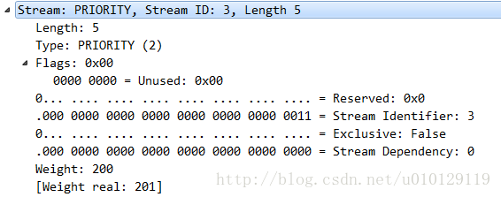

## 帧格式

`PRIORITY`帧（type = 0x2）指定了流发送者建议的优先级。 它可以以任何流状态发送，包括空闲或封闭的流。

```
 +-+-------------------------------------------------------------+
 |E|                  Stream Dependency (31)                     |
 +-+-------------+-----------------------------------------------+
 |   Weight (8)  |
 +-+-------------+
```

`PRIORITY`帧的有效载荷包含以下字段：

- **E** ：表示流依赖性是唯一的单比特标志。
- **Stream Dependency/流依赖** ：该数据流依赖的流的31位流标识符。
- **Weight/权重**：一个无符号的8位整数，表示流的优先级权重。 将值加1以获得介于1和256之间的权重。

PRIORITY帧在wireshark中所示：



## 标志

PRIORITY帧不定义任何标志。

## 负载

PRIORITY帧始终标识一个流。如果接收到一个流标识符为0x0的PRIORITY帧，接收方必须响应`PROTOCOL_ERROR`类型的连接错误。

PRIORITY帧可以在任何状态下的流上发送，尽管它不能在构成单个header块的连续帧之间发送。请注意，此帧可能在处理完成或帧发送完成后到达，这会导致它对已识别的流没有任何影响。对于处于“half-closed (remote)”或“closed”状态的流，此帧只能影响对已识别流及其依赖流的处理;它不会影响该流上的帧传输。 

PRIORITY帧可以从处于“idle”或“closed”状态的流中发送。这允许通过改变未使用或已关闭的父流的优先级来重新设置一组从属流的优先级。长度不是5个字节的PRIORITY帧必须被视为类型为`FRAME_SIZE_ERROR`的流错误。