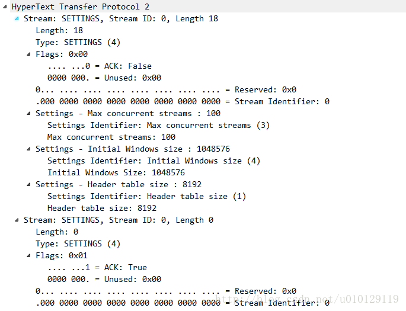

`SETTINGS`帧（type= 0x4）传达影响端点通信方式的配置参数，例如对对等行为的偏好和约束。 SETTINGS帧也用于确认收到这些参数。单独地，SETTINGS参数也可以被称为“setting”。

SETTINGS参数不协商;它们描述了发送端的特征，被接收端使用。每个对等体可以通告相同参数的不同值。例如，客户端可能会设置较高的初始流量控制窗口，而服务器可能会设置较低的值以节省资源。

设置帧必须在连接开始时由两个端点发送，并且可以在连接的整个生命周期内由任一端点在任何其他时间发送。实现必须支持本规范定义的所有参数。

`SETTINGS`帧中的每个参数都会替换该参数的任何现有值。参数按它们出现的顺序进行处理，并且`SETTINGS`帧的接收者不需要保持除参数当前值以外的任何状态。因此，SETTINGS参数的值是接收器看到的最后一个值。

`SETTINGS`参数由接收方确认。为了实现这一点，SETTINGS帧定义了以下标志：

- **ACK** （0x1）：若设置，位0表示该帧确认接收和应用对等设备帧。 当该位设置时，SETTINGS帧的有效载荷必须为空。 收到一个设置了ACK标志并且长度字段值不为0的SETTINGS帧必须被视为FRAME_SIZE_ERROR类型的连接错误。

**`SETTINGS`帧始终适用于连接，而不是单个流。** 设置帧的流标识必须为零（0x0）。 如果端点收到SETTINGS帧，其流标识符字段不是0x0，那么端点必须响应一个类型为`PROTOCOL_ERROR`的连接错误。 

SETTINGS帧影响连接状态。 错误格式或不完整的SETTINGS帧必须被视为类型为PROTOCOL_ERROR的连接错误。 

长度不是6个字节（备注：即48bit，48=16+32）倍数的SETTINGS帧必须被视为`FRAME_SIZE_ERROR`类型的连接错误。

## 帧格式

SETTINGS帧的有效载荷由零个或多个参数组成，每个参数由一个`无符号的16位设置标识符`和一个`无符号的32位值`组成。

```
 +-------------------------------+
 |       Identifier (16)         |
 +-------------------------------+-------------------------------+
 |                        Value (32)                             |
 +---------------------------------------------------------------+
```

SETTINGS帧在wireshark中所示： 



### SETTINGS参数定义

如下参数定义：

- **SETTINGS_HEADER_TABLE_SIZE** （0x1）：允许发送者以字节的形式通知远程端点用于解码header块的header压缩表的最大尺寸。编码器可以通过使用特定于header块内头部压缩格式的信令来选择等于或小于此值的任何大小。初始值是4,096个字节。

- **SETTINGS_ENABLE_PUSH** （0x2）：此设置可用于禁用服务器推送。如果一个端点接收到这个参数设置为0的值，它不应该发送一个PUSH_PROMISE帧。一个端点既将这个参数设置为0，并且确认它也必须将PUSH_PROMISE帧的接收视为类型为PROTOCOL_ERROR的连接错误。

  初始值为1，表示允许服务器推送。除0或1以外的任何值必须视为PROTOCOL_ERROR类型的连接错误。

- **SETTINGS_MAX_CONCURRENT_STREAMS** （0x3）：表示发件人允许的最大并发流数。这个限制是有方向性的：它适用于发送者允许接收者创建的数据流。最初，这个值没有限制。建议此值不小于100，以免不必要地限制并行性。

  值为0的SETTINGS_MAX_CONCURRENT_STREAMS不应被视为特殊的端点。零值确实会阻止创建新的流;然而，这也可能发生在活动流所耗尽的任何限制上。服务器应该只在短时间内设置一个零值;如果服务器不希望接受请求，关闭连接更合适。

- **SETTINGS_INITIAL_WINDOW_SIZE** （0x4）：指示发送者的流级别流控制的初始窗口大小（以八位字节为单位）。初始值是2 ^ 16-1（65,535）个八位组。

  该设置会影响所有流的窗口大小。高于最大流量控制窗口大小2 ^ 31-1的值必须视为FLOW_CONTROL_ERROR类型的连接错误。

- **SETTINGS_MAX_FRAME_SIZE** （0x5）：指示发送者愿意接收的最大帧有效载荷的大小，以八位字节为单位。初始值是2 ^ 14（16,384）个八位字节。端点通告的值必须在该初始值和最大允许帧大小之间（2 ^ 24-1或16,777,215个八位字节），包括在内。此范围之外的值务必视为PROTOCOL_ERROR类型的连接错误。

- **SETTINGS_MAX_HEADER_LIST_SIZE** （0x6）：此通报设置以八位字节的形式通知对等方发送方准备接受的header列表的最大大小。该值基于header字段的未压缩大小，包括名称和八位字节的值的长度，以及每个header字段的开销32个字节。

  对于任何给定的请求，可能会强制实施一个比所宣传的更低的限制。此设置的初始值是无限的。

接收到带有任何未知或不支持标识符的SETTINGS帧的端点必须忽略该设置。

### Settings 同步

SETTINGS中的大部分值受益于或需要了解对等体何时接收并应用更改的参数值。 为了提供这样的同步时间点，其中未设置ACK标志的SETTINGS帧的接收方必须在收到后尽快应用更新的参数。

SETTINGS帧中的值必须按照它们出现的顺序进行处理，值之间没有其他帧处理。 不支持的参数必须被忽略。 一旦所有值都被处理完毕，接收者必须立即发出一个设置了ACK标志的SETTINGS帧。 一旦接收到设置了ACK标志的SETTINGS帧，改变参数的发送者就可以依赖已经应用的设置。 

如果SETTINGS帧的发送者在合理的时间内没有收到确认，它可能会发出`SETTINGS_TIMEOUT`类型的连接错误。