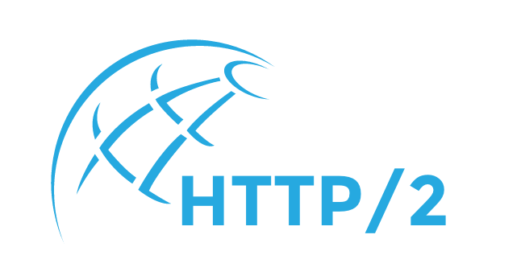

### 内容介绍

HTTP/2 是 HTTP 协议的最新版本。

================

从HTTP官方摘抄：

> HTTP/2 is a replacement for how HTTP is expressed “on the wire.” It is not a ground-up rewrite of the protocol; HTTP methods, status codes and semantics are the same, and it should be possible to use the same APIs as HTTP/1.x (possibly with some small additions) to represent the protocol.

> The focus of the protocol is on performance; specifically, end-user perceived latency, network and server resource usage. One major goal is to allow the use of a single connection from browsers to a Web site.

> The basis of the work was SPDY, but HTTP/2 has evolved to take the community’s input into account, incorporating several improvements in the process.