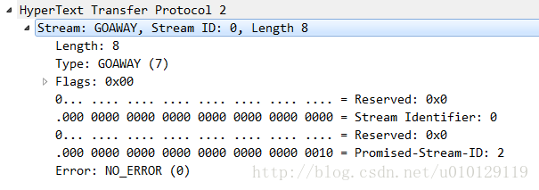

# GOAWAY帧

## 帧格式

`GOAWAY`帧（类型= 0x7）用于**启动连接关闭或发出严重错误状态信号**。 GOAWAY允许端点正常停止接受新的流，同时仍然完成对先前建立的流的处理。这可以实现管理操作，例如服务器维护。

在端点开始新流和端点远程发送GOAWAY帧之间存在固有的竞争条件。为了处理这种情况，GOAWAY包含在此连接中的发送端点上已处理或可能处理的最后一个peer-initiated流的流标识符。例如，如果服务器发送GOAWAY帧，则标识的流是由客户端发起的编号最大的流。

一旦发送，如果流的标识符高于包含的最后流标识符，则发送方将忽略由接收方发起的流上发送的帧。 GOAWAY帧的接收者不能在连接上打开额外的流，尽管可以为新的流建立新的连接。

如果GOAWAY的接收者已经发送了具有比GOAWAY帧更高的流标识符的流的数据，那么这些流不被处理或将不被处理。 GOAWAY帧的接收者可以将这些流视为从未被创建，从而允许这些流稍后在新连接上重试。

端点应该总是在关闭连接之前发送一个GOAWAY帧，以便远程节点可以知道流是否已被部分处理。例如，如果HTTP客户端在服务器关闭连接的同时发送POST，则客户端无法知道服务器是否开始处理该POST请求，如果服务器未发送GOAWAY帧来指示它可能具有哪些流采取行动。

对于行为不当的对端，端点可以选择关闭连接而不发送GOAWAY。 

GOAWAY帧可能不会立即关闭连接之前; GOAWAY的接收器不再用于连接应该在终止连接之前仍然发送GOAWAY帧。

```
 +-+-------------------------------------------------------------+
 |R|                  Last-Stream-ID (31)                        |
 +-+-------------------------------------------------------------+
 |                      Error Code (32)                          |
 +---------------------------------------------------------------+
 |                  Additional Debug Data (*)                    |
 +---------------------------------------------------------------+
```

GOAWAY帧在wireshark中所示：



## 标志

GOAWAY帧不定义任何标记。

## 说明

GOAWAY帧适用于连接，而不是特定的流。 端点必须将带有0x0以外的流标识符的GOAWAY帧视为类型为PROTOCOL_ERROR的连接错误。

GOAWAY帧还包含一个32位错误代码（第7节），其中包含关闭连接的原因。端点可以将不透明数据附加到任何GOAWAY帧的有效载荷。额外的调试数据仅用于诊断目的，并没有语义值。调试信息可能包含安全或隐私敏感数据。记录或以其他方式持久存储的调试数据必须有足够的安全措施以防止未经授权的访问。

TBD...